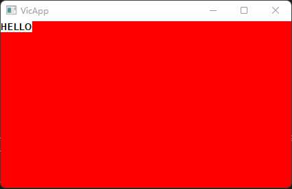

# 让我们写一个 Win32 文本编辑器吧 - 2. 计划和显示

> 如果你已经阅读了[`简介`](https://mp.weixin.qq.com/s/YHxyZZwF7YVHDjuiaARThQ)，相信你已经对我们接下来要做的事情有所了解。
>
> 本文，将会把[`简介`](https://mp.weixin.qq.com/s/YHxyZZwF7YVHDjuiaARThQ)中基础程序修改为一个窗体应用程序。并对编辑器接下来的编辑计划进行说明。

## 1. 程序改造

阅读过[`曾经我认为C语言就是个弟弟`](https://mp.weixin.qq.com/s/gcGNQnoAjsy1vdHkDVzBaA)这篇文章的读者应该知道，编辑器（包括所有[`Win32`](https://docs.microsoft.com/en-us/windows/win32/learnwin32/learn-to-program-for-windows)应用程序控件），本质上都是一个窗口（[`WNDCLASSA`](https://docs.microsoft.com/en-us/windows/win32/api/winuser/ns-winuser-wndclassa)(已被[`WNDCLASSEX`](https://docs.microsoft.com/en-us/windows/win32/api/winuser/ns-winuser-wndclassexa)取代)结构体描述）。

在本节，我们将对[上一篇文章](https://mp.weixin.qq.com/s/YHxyZZwF7YVHDjuiaARThQ)所建立的项目进行改造，使其弹出一个主窗体，并附加一个编辑器窗体。

1. 设置项目子系统

在之前，我们为了简便，没有修改 `vicapp` 项目的子系统，其默认值为控制台应用程序，所以我们可以用如下代码调用 `vitality-controls` 给出的函数 `vic_prints`。

```C
#include "../../shared-include/vitality-controls.h"

int main(int argc, char** argv) {
	vic_prints("hello vic.");
	return 0;
}
```

但是，对于一个编辑器来说，应该是一个窗体应用程序。所以，我们要对 `vicapp` 进行子系统设置，打开 `vicapp` 项目属性（参考[上一篇文章](https://mp.weixin.qq.com/s/YHxyZZwF7YVHDjuiaARThQ)），最终设置如下：


2. 修改主程序代码

修改之系统为`窗口`后，编译程序，会发现如下错误：


这是因为，链接程序会根据项目设置，去查找不同的主函数名称，而对于`窗体`应用程序，其主函数名应为`WinMain`，所以这里会报找不到符号 `WinMain`，因为我们没有定义它。

对于不同项目类型的启动函数定义，参考文件`VS安装目录\VC\Tools\MSVC\14.31.31103\crt\src\vcruntime\exe_common.inl`, 现在将相关代码列出如下：

```C
#if defined _SCRT_STARTUP_MAIN

    using main_policy = __scrt_main_policy;
    using file_policy = __scrt_file_policy;
    using argv_policy = __scrt_narrow_argv_policy;
    using environment_policy = __scrt_narrow_environment_policy;

    static int __cdecl invoke_main()
    {
        return main(__argc, __argv, _get_initial_narrow_environment());
    }

#elif defined _SCRT_STARTUP_WMAIN

    using main_policy = __scrt_main_policy;
    using file_policy = __scrt_file_policy;
    using argv_policy = __scrt_wide_argv_policy;
    using environment_policy = __scrt_wide_environment_policy;

    static int __cdecl invoke_main()
    {
        return wmain(__argc, __wargv, _get_initial_wide_environment());
    }

#elif defined _SCRT_STARTUP_WINMAIN

    using main_policy = __scrt_winmain_policy;
    using file_policy = __scrt_file_policy;
    using argv_policy = __scrt_narrow_argv_policy;
    using environment_policy = __scrt_narrow_environment_policy;

    static int __cdecl invoke_main()
    {
        return WinMain(
            reinterpret_cast<HINSTANCE>(&__ImageBase),
            nullptr,
            _get_narrow_winmain_command_line(),
            __scrt_get_show_window_mode());
    }

#elif defined _SCRT_STARTUP_WWINMAIN

    using main_policy = __scrt_winmain_policy;
    using file_policy = __scrt_file_policy;
    using argv_policy = __scrt_wide_argv_policy;
    using environment_policy = __scrt_wide_environment_policy;

    static int __cdecl invoke_main()
    {
        return wWinMain(
            reinterpret_cast<HINSTANCE>(&__ImageBase),
            nullptr,
            _get_wide_winmain_command_line(),
            __scrt_get_show_window_mode());
    }

#elif defined _SCRT_STARTUP_ENCLAVE || defined _SCRT_STARTUP_WENCLAVE

    using main_policy = __scrt_enclavemain_policy;
    using file_policy = __scrt_nofile_policy;
    using argv_policy = __scrt_no_argv_policy;
    using environment_policy = __scrt_no_environment_policy;

#if defined _SCRT_STARTUP_ENCLAVE
    static int __cdecl invoke_main()
    {
        return main(0, nullptr, nullptr);
    }
#else
    static int __cdecl invoke_main()
    {
        return wmain(0, nullptr, nullptr);
    }
#endif

#endif
```

可以看到，根据不同的宏定义，函数 `invoke_main()` 函数的定义也不相同，由于我们的编辑器应该支持`Unicode`字符，并且我们是一个窗体应用程序。所以，我们主函数应该参考 `_SCRT_STARTUP_WWINMAIN` 宏定义内的主函数定义。

除了在 `exe_common.inl` 中定义了主函数的调用函数，另外，窗体应用程序的主函数还在 `WinBase.h`（该文件可以通过 `Windows.h` 查找到 `#include "WinBase.h"` 一行，然后打开，或者可以直接引用） 文件中做了定义，如下：

```C
#if WINAPI_FAMILY_PARTITION(WINAPI_PARTITION_DESKTOP)

int
#if !defined(_MAC)
#if defined(_M_CEE_PURE)
__clrcall
#else
WINAPI
#endif
#else
CALLBACK
#endif
WinMain (
    _In_ HINSTANCE hInstance,
    _In_opt_ HINSTANCE hPrevInstance,
    _In_ LPSTR lpCmdLine,
    _In_ int nShowCmd
    );

int
#if defined(_M_CEE_PURE)
__clrcall
#else
WINAPI
#endif
wWinMain(
    _In_ HINSTANCE hInstance,
    _In_opt_ HINSTANCE hPrevInstance,
    _In_ LPWSTR lpCmdLine,
    _In_ int nShowCmd
    );

#endif /* WINAPI_FAMILY_PARTITION(WINAPI_PARTITION_DESKTOP) */
```

根据之前的描述，我们把之前的 `vitality-controls.h` 修改为如下代码：

```C
#pragma once

#ifdef VITALITY_CONTROLS_EXPORTS
#define VIC_API __declspec(dllexport)
#else
#define VIC_API __declspec(dllimport)
#endif // VITALITY_CONTROLS_EXPORTS

#include <Windows.h>

/**
* 函数描述：
*	初始化编辑器环境，需要在调用任何本程序集的函数之前，
*	调用本函数。
* 
* 返回值：
*	如果初始化成功，返回 TRUE，否则返回 FALSE，并设置错误码，
*	错误码可以通过 GetLastError() 获取。
*/
VIC_API BOOL Vic_Init();

/**
* 函数描述：
*	创建并初始化一个编辑器。
* 
* 参数：
*	parent: 新创建的编辑器的父窗体。
* 
* 返回值：
*	如果创建控件成功，返回该控件的句柄，否则返回 -1 并设置错误码。
*	错误码可以通过 GetLastError() 获取。
*/
VIC_API HWND Vic_CreateEditor(
	HWND parent
);
```

首先，我们将 `stdio.h` 的引用，换成了 `Windows.h`，这允许我们使用 `Windows` 关于桌面应用程序的 `API`。

其次，我们去除了 `vic_print` 函数的定义。因为该函数主要是[上一篇文章](https://mp.weixin.qq.com/s/YHxyZZwF7YVHDjuiaARThQ)测试跨 `DLL` 调用函数的测试函数。现在，我们不再需要它。

同时，我们添加了两个函数：
- Vic_Init
    用于初始化环境，主要是注册我们编辑器的窗体类。至于要特别添加一个初始化函数，主要是由于[`微软官方文档`](https://docs.microsoft.com/en-us/windows/win32/dlls/dynamic-link-library-best-practices)中明确指出，在 [`DllMain`](https://docs.microsoft.com/en-us/windows/win32/dlls/dllmain) 中调用复杂的函数，可能会造成死锁。
- Vic_CreateEditor
    用于创建一个编辑器，这里暂时不需要指定编辑器的信息，只是指定一个父窗体的句柄，以便将编辑器添加到窗体。参考[`曾经我认为C语言就是个弟弟`](https://mp.weixin.qq.com/s/gcGNQnoAjsy1vdHkDVzBaA)中创建编辑器控件的代码。

接下来，我们还要实现这两个函数。
在项目 `vitality-controls` 的 `src\include\` 目录，建立一个 `common.h` 文件，输入如下内容：

```C
#pragma once

#include "../../../shared-include/vitality-controls.h"

#define EDITOR_CLASS_NAME L"VicEditor"

 
LRESULT CALLBACK TextEditorWindowProc(HWND hwnd, UINT uMsg, WPARAM wParam, LPARAM lParam);


```

其中，该文件引入了外部 `API` 文件定义，同时，声明了一个宏 `EDITOR_CLASS_NAME`，该宏定义了我们要创建的目标编辑器的类名。

在项目 `vitality-controls` 的 `src\controls\` 文件夹下，建立一个 `init.c` 文件，并编辑如下代码：

```C
#include "../include/common.h"

/**
* 函数描述：
*	初始化编辑器环境，需要在调用任何本程序集的函数之前，
*	调用本函数。
*/
VIC_API BOOL Vic_Init() {
	WNDCLASSEX wnd = { 0 };

	wnd.cbSize = sizeof(wnd);
	wnd.hInstance = GetModuleHandle(NULL);
	wnd.lpszClassName = EDITOR_CLASS_NAME;
	wnd.hbrBackground = CreateSolidBrush(RGB(255, 0, 0));
	wnd.hCursor = LoadCursor(NULL, IDC_IBEAM);
	wnd.style = CS_GLOBALCLASS | CS_PARENTDC | CS_DBLCLKS;
	wnd.lpfnWndProc = TextEditorWindowProc;

	return RegisterClassEx(&wnd) != 0;
}
```

在项目 `vitality-controls` 的 `src\controls\` 文件夹下，建立一个 `common.c` 文件，并输入如下代码：

```C
#include "../include/common.h"

/**
* 函数描述：
*	创建并初始化一个编辑器。
*
* 参数：
*	parent: 新创建的编辑器的父窗体。
*
* 返回值：
*	如果创建控件成功，返回该控件的句柄，否则返回 NULL 并设置错误码。
*	错误码可以通过 GetLastError() 获取。
*/
VIC_API HWND Vic_CreateEditor(
	HWND parent
) {
	RECT rect = { 0 };

	if (!GetClientRect(parent, &rect)) {
		return NULL;
	}

	return CreateWindowEx(
		0,
		EDITOR_CLASS_NAME,
		L"",
		WS_CHILD | WS_VISIBLE | ES_MULTILINE |
		WS_VSCROLL | WS_HSCROLL |
		ES_AUTOHSCROLL | ES_AUTOVSCROLL,
		0, 0,
		rect.right,
		rect.bottom,
		parent,
		NULL,
		GetModuleHandle(NULL),
		NULL
	);
}

LRESULT CALLBACK TextEditorWindowProc(HWND hwnd, UINT uMsg, WPARAM wParam, LPARAM lParam) {
	switch (uMsg) {
	case WM_PAINT: {
		PAINTSTRUCT ps;
		HDC hdc = BeginPaint(hwnd, &ps);

		TextOut(hdc, 0, 0, L"HELLO", 5);

		EndPaint(hwnd, &ps);
		return 0;
	}
	default:
		break;
	}
	return DefWindowProc(hwnd, uMsg, wParam, lParam);
}
```
其中，新增了一个 `TextEditorWindowProc` 函数，该函数是我们编辑器的回调函数，参考 `init.c` 文件中，对 `wnd.lpfnWndProc` 字段的赋值。关于回调函数，[`参考文档`](https://docs.microsoft.com/en-us/windows/win32/api/winuser/ns-winuser-wndclassexw)。

最后，让我们修改我们应用程序的主函数，修改项目 `vicapp` 的主程序文件 `vicapp-main.c` 如下所示：

```C

#include <Windows.h>
#include "../../shared-include/vitality-controls.h"

LRESULT CALLBACK MainWindowProc(HWND hwnd, UINT uMsg, WPARAM wParam, LPARAM lParam);

PCWSTR MAIN_CLASS_NAME = L"VIC-APP-MAIN";

HWND editorHwnd = NULL;

LRESULT CALLBACK MainWindowProc(HWND hwnd, UINT uMsg, WPARAM wParam, LPARAM lParam)
{
	switch (uMsg)
	{
	case WM_DESTROY:
		PostQuitMessage(0);
		return 0;
	case WM_CREATE: {
		editorHwnd = Vic_CreateEditor(hwnd);
		if (editorHwnd == 0) {
			int lastError = GetLastError();
			ShowWindow(hwnd, 0);
		}
		return 0;
	}
	case WM_SIZE: {
		RECT rect = { 0 };
		if (!GetWindowRect(hwnd, &rect)) {
			break;
		}
		MoveWindow(
			editorHwnd,
			0,
			0,
			rect.right,
			rect.bottom,
			TRUE
		);
		return 0;
	}
	default:
		break;
	}
	return DefWindowProc(hwnd, uMsg, wParam, lParam);
}

BOOL InitApplication(HINSTANCE hinstance)
{
	WNDCLASSEX wcx = { 0 };

	wcx.cbSize = sizeof(wcx);
	wcx.style = CS_HREDRAW | CS_VREDRAW;
	wcx.lpfnWndProc = MainWindowProc;
	wcx.cbClsExtra = 0;
	wcx.cbWndExtra = 0;
	wcx.hInstance = hinstance;
	wcx.hIcon = LoadIcon(NULL, IDI_APPLICATION);
	wcx.hCursor = LoadCursor(NULL, IDC_ARROW);
	wcx.hbrBackground = GetStockObject(WHITE_BRUSH);
	wcx.lpszClassName = MAIN_CLASS_NAME;
	wcx.hIconSm = LoadImage(
		hinstance,
		MAKEINTRESOURCE(5),
		IMAGE_ICON,
		GetSystemMetrics(SM_CXSMICON),
		GetSystemMetrics(SM_CYSMICON),
		LR_DEFAULTCOLOR
	);

	return RegisterClassEx(&wcx);
}

BOOL InitInstance(HINSTANCE hinstance, int nCmdShow)
{
	HWND hwnd = CreateWindowEx(
		0,
		MAIN_CLASS_NAME,
		L"VicApp",
		WS_OVERLAPPEDWINDOW,
		CW_USEDEFAULT,
		CW_USEDEFAULT,
		CW_USEDEFAULT,
		CW_USEDEFAULT,
		(HWND)NULL,
		(HMENU)NULL,
		hinstance,
		(LPVOID)NULL
	);

	if (!hwnd) {
		return FALSE;
	}

	ShowWindow(hwnd, nCmdShow);
	UpdateWindow(hwnd);
	return TRUE;
}

int WINAPI wWinMain(
	_In_ HINSTANCE hInstance,
	_In_opt_ HINSTANCE hPrevInstance,
	_In_ LPWSTR lpCmdLine,
	_In_ int nShowCmd
) {
	MSG msg = { 0 };

	if (!Vic_Init()) {
		int err = GetLastError();

		return FALSE;
	}

	if (!InitApplication(hInstance))
		return FALSE;

	if (!InitInstance(hInstance, nShowCmd))
		return FALSE;

	BOOL fGotMessage;
	while ((fGotMessage = GetMessage(&msg, (HWND)NULL, 0, 0)) != 0 && fGotMessage != -1)
	{
		TranslateMessage(&msg);
		DispatchMessage(&msg);
	}
	return msg.wParam;
}
```

其中，在出程序的第一句，我们调用了控件初始化函数 `Vic_Init`，并在创建主窗体的事件处理过程中，调用了 `Vic_CreateEditor` 函数，创建了一个子窗体，该子窗体就是我们的编辑器。

为了突出显示我们的编辑器，我们在 `Vic_Init` 函数中，设置背景颜色为红色，代码如下：

```C
wnd.hbrBackground = CreateSolidBrush(RGB(255, 0, 0));
```

编译，并运行我们的程序，可以看到如下窗体：



由于我们在处理函数 `TextEditorWindowProc` 中，在窗体上绘制了字符串 `"HELLO"`。所以，可以看到界面上出现了 `"HELLO"` 的字样，并且背景色为红色。

## 2. 之后的计划

由于代码编辑的过程中，想法可能发生改变，所以未来的计划并不是固定死的，有可能发生变更。

通常情况下，变更的可能有：

- 发现了某个功能的更好的实现方式。
- 某个功能过于复杂，导致一篇文章写不完。

虽然计划可能会变更，但是大致的思路如下：

1. 背景设置

    在这里，你将看到，如何设置背景色，或者将我们的编辑器背景设置为一张图片。
    这个过程可能要耗费一节。

2. 文本绘制

    主要目的是将当前使用 `GDI` 的文本绘制转换为 `DirectWrite` 绘制。
    这个过程可能要耗费一节。

3. 光标

    在此小节，我们将会看到如何将光标显示在编辑器的指定位置。
    这个过程可能要耗费一节。

4. 鼠标选择和高亮

    在此主题下，我们将会为我们的编辑器添加鼠标选择，以及选择区域高亮显示的支持。
    这个过程可能要耗费 2~3 个小结。

5. 文本内存结构

    这将是一个比较大的主题，因为文件内容在内存中的保存，根据不同的考虑，将会采用不同的内存结构。
    这个过程可能要耗费 2~3 个小结。

6. 滚动条实现

    由于我们计划让我们的编辑器可编辑的文件尽可能的大，并且 `Windows` 自带的滚动条的取值范围有限，所以我们打算实现一个滚动条，其最大取值为 `UINT64` 的最大取值，这样我们可以处理总行数就大大增加。
    这个过程可能要耗费一节。

7. `Unicode` 支持

    这个主题下，我们会对 `Unicode` 编码格式做一个简单的介绍，并实现对 `Unicode` 字符的显示。
    这个过程可能要耗费 2~3 个小结。


8. 文本透明度设置

    由于我们的编辑器允许我们设置背景颜色，甚至背景图片，考虑到文本颜色可能和背景色相近，导致不容易区分，那么文本的透明渲染就很有必要了。如果我们的文本是透明的，那就可以和背景色相结合，生成更丰富的颜色搭配，起到更好的阅读体验的目的。
    这个过程可能要耗费 1~2 个小结。

9. 添加注解

    到此为止，我们的编辑器已经可以显示内容，选择内容，上下左右滚动，是时候添加注解功能了。
    这个过程可能要耗费 1~2 个小结。

10. 添加样式支持

    这里所谓的样式，是根据配置，识别出文件的不同组成部分，然后将给定识别部分显示为固定颜色。如下方代码：
    ```C
    int main(int argc, char** argv) {
        return 0;
    }
    ```
    根据配置，将会分别以不同的颜色/字体显示不同的元素，如类型 `int` 将会被显示为蓝色等等。
    这意味着，过了本节，你将至少可以实现一种编程语言的高亮功能。
    当前，我们考虑实现 `C语言` 的高亮显示。


好了，到此为止，我们已经能够将我们的控件显示出来了，计划也已经说明。如果你有什么建议，或者发现程序中有 `BUG`，欢迎到本文档所在项目[`lets-write-a-edit-control `](https://github.com/vitalitylee/lets-write-a-edit-control)下留言，或者到源代码项目 [`vitality-controls`](https://github.com/vitalitylee/vitality-controls) 下提交 `issue`。

如果像针对本文留言，关注微信公众号`编程之路漫漫`，码途求知己，天涯觅一心。

<center>
    
</center>